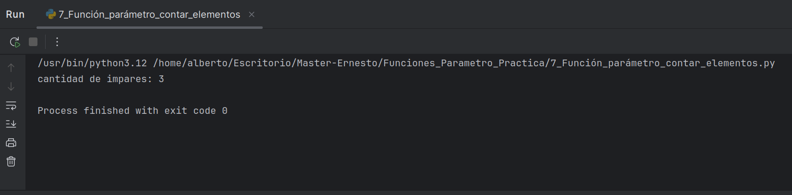

# Contador de Números Pares e Impares (Función Python)
Descripción del Proyecto
- Este repositorio implementa una función sencilla pero útil para contar la cantidad de números pares e impares dentro de una secuencia de elementos (parámetros) que se le pasen. 
- Es un excelente ejemplo para entender cómo definir y utilizar funciones con un número variable de argumentos (*args), así como aplicar lógica condicional para la clasificación de números.

## Características Principales
- Función Reutilizable: Define una función clara y modular para realizar la tarea de conteo.

- Manejo de Argumentos Variables: Demuestra cómo una función puede aceptar un número ilimitado de argumentos posicionales (usando *args).

- Lógica de Pares e Impares: Utiliza el operador módulo (%) para identificar y clasificar números como pares o impares.

- Resultados Claros: Retorna o imprime el total de números pares y el total de números impares encontrados.

  
  
